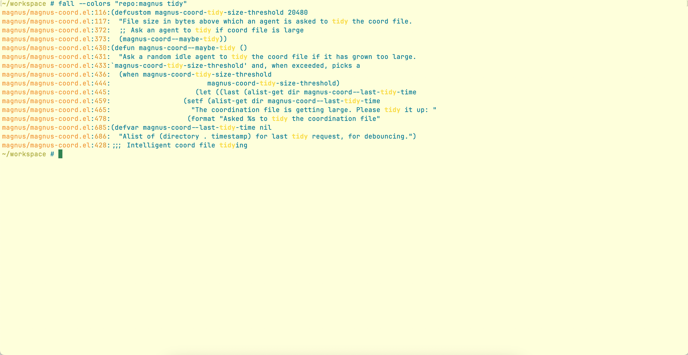

# fall

**Find ALL.** Instant code search across all your repos.

fall is a lightweight CLI that gives you indexed, sub-millisecond code search across your projects. Built on [zoekt](https://github.com/sourcegraph/zoekt) (the engine behind Sourcegraph and Google's internal code search), it creates trigram indices for near-instant substring, regex, and symbol lookups.

Designed for humans and AI agents alike — plain output for machines, fall-colored output for humans.



## Quick Start

```sh
# Install
go install github.com/hrishikeshs/fall@latest

# Add your repos
fall add ~/projects/my-app ~/projects/my-lib

# Search
fall "handleRequest"
```

That's it. Search is instant.

## Install

**Go** (recommended):

```sh
go install github.com/hrishikeshs/fall@latest
```

You also need the zoekt indexer (one-time):

```sh
go install github.com/sourcegraph/zoekt/cmd/zoekt-git-index@latest
go install github.com/sourcegraph/zoekt/cmd/zoekt-webserver@latest  # optional, for web UI
```

**From source:**

```sh
git clone https://github.com/hrishikeshs/fall
cd fall
make install  # builds and copies to ~/bin
```

## Usage

### Search

```sh
fall "functionName"                 # search all indexed repos
fall "repo:myapp handleRequest"     # filter by repo name
fall "file:*.go func main"          # filter by file pattern
fall "lang:swift class AppDelegate" # filter by language
fall "/error.*handler/"             # regex search
fall -l "TODO"                      # list matching files only
fall --json "config"                # JSONL output (for scripts/agents)
fall --colors "auth"                # fall-colored output (for humans)
```

### Index

```sh
fall add .                          # add current repo
fall add ~/work/api ~/work/web      # add multiple repos
fall list                           # show indexed repos
```

### Web UI & Auto Re-indexing

`fall serve` starts a background daemon that runs zoekt's web UI and automatically re-indexes all tracked repos every 20 minutes. No cron jobs needed.

```sh
fall serve start                    # start daemon on :6070
fall serve status                   # check if running
fall serve stop                     # stop the daemon
fall serve restart                  # restart
open http://localhost:6070          # browse in your browser
```

The daemon keeps your indices fresh — just `fall add` your repos once and let it run. Set `FALL_SERVE_LISTEN` to change the port (default `:6070`).

## Search Flags

| Flag | Default | Description |
|------|---------|-------------|
| `--colors` | off | Fall-colored ANSI highlighting |
| `--json` | off | JSONL output (one object per match) |
| `-l` | off | List matching files only |
| `-n` | 50 | Max file results |
| `--context` | 0 | Context lines around matches |
| `--index-dir` | `~/.zoekt` | Override index directory |

## Query Syntax

fall uses [zoekt's query language](https://github.com/sourcegraph/zoekt):

| Query | Matches |
|-------|---------|
| `foo bar` | Files containing both "foo" and "bar" |
| `"exact phrase"` | Literal phrase |
| `/pattern/` | Regular expression |
| `repo:name` | Filter by repository name (substring) |
| `file:*.go` | Filter by file path pattern |
| `lang:python` | Filter by programming language |
| `sym:MyClass` | Symbol search |
| `case:yes foo` | Case-sensitive search |
| `-test` | Exclude matches containing "test" |
| `foo or bar` | Match either term |

## For Claude Code Agents

fall's default output is optimized for AI agents — clean `repo/file:line:content` format with no color codes or decorations. Agents can search via the Bash tool:

```sh
# In a Claude Code session
fall "repo:myapp handleRequest"
fall --json "error" | head -5    # structured output for parsing
fall -l "migrations"              # find relevant files
```

## How It Works

1. `fall add` runs `zoekt-git-index` to build trigram indices from your git repos
2. Indices are stored in `~/.zoekt` (roughly 3x the source size)
3. `fall <query>` memory-maps the index shards and searches in microseconds
4. No server needed for search — it reads the index files directly
5. `fall serve start` runs a daemon that re-indexes tracked repos every 20 minutes

## License

MIT
